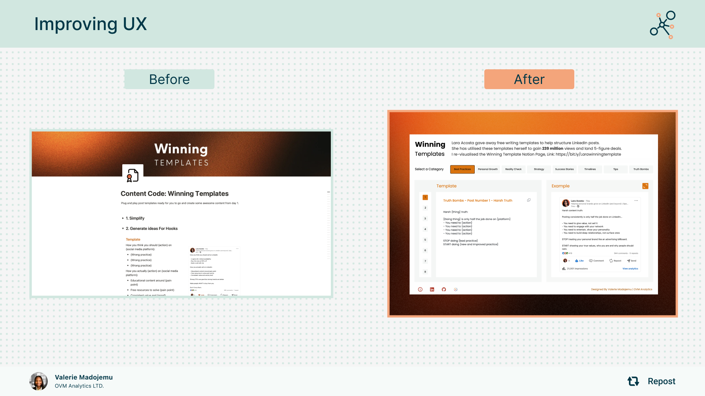

# Lara's Winning Templates - Interactive Content Library

**Project Goal**: Improve the UX of Lara Acosta's Winning Templates to allow users to select the ideal writing template at every stage.

**Tableau Dashboard** - https://public.tableau.com/app/profile/valerie.madojemu/viz/WinningTemplates/Dashboard



**Context**: A data pipeline project that transforms 62 proven LinkedIn content templates from Notion into an organised, interactive library optimised for content creators and marketing teams.

## What This Project Delivers

A complete interactive library of 62 proven LinkedIn content templates, organised into 8 strategic categories with optimised images and copy-friendly functionality. Users can easily browse, preview, and copy templates for immediate use in their content creation workflow.

**Key Features:**
- 62 professionally formatted content templates
- 8 logical categories for intuitive navigation
- One-click copy functionality for seamless workflow
- Optimised images for fast loading and dashboard integration
- Permanent GitHub Pages hosting for reliable access

## Key Problems Solved

### Problem 1: Template Discovery & Selection
**Challenge**: Users struggled to find the right template from 62 options without clear organisation.

**Solution**: Created 8 logical categories (Tips, Personal Growth, Strategy, etc.) with sequential numbering for easy navigation.

### Problem 2: Temporary Image URLs
**Challenge**: Original Notion image URLs expired, breaking dashboard visualisations and user experience.

**Solution**: Migrated all assets to GitHub Pages for permanent, reliable URLs that never expire.

### Problem 3: Performance Issues
**Challenge**: Original images (300KB-2MB) were too large for optimal dashboard performance in Tableau.

**Solution**: Optimised all 62 images to under 200KB whilst maintaining visual quality, ensuring fast loading times.

### Problem 4: Content Copy Experience
**Challenge**: Users couldn't easily copy template text from visualisation dashboards.

**Solution**: Explored multiple approaches including Tableau's URL feature for text integration, but ultimately opted for interactive HTML templates with one-click copy functionality, providing a superior user experience.

## Final Deliverables

### 📁 Content Templates
- 62 interactive HTML files with copy buttons
- Organised across 8 categories
- Clean, professional formatting
- Instant copy-to-clipboard functionality

### 📁 Image Templates  
- Matching HTML viewers for template images
- Same organisational structure
- Optimised for web viewing

### 📁 Images
- **Full-quality images**: Original resolution for high-end use
- **Optimised images**: <200KB versions for dashboard integration
- Permanent GitHub Pages URLs for reliable access

**Repository Structure:**
```
Lara_Winning_Templates/
├── content_templates/
│   ├── Best_Practices/ (8 templates)
│   ├── Personal_Growth/ (9 templates)
│   ├── Tips/ (11 templates)
│   └── [5 more categories]
├── image_templates/
└── images/
    ├── full-quality-images/
    └── optimised-images/
```

## Content Organisation

Templates grouped into 8 user-friendly categories:
- **Personal Growth** (9 templates): Transformation stories, mindset shifts
- **Tips** (11 templates): Actionable advice and practical guidance  
- **Truth Bombs** (8 templates): Direct, honest perspectives
- **Strategy** (6 templates): Systematic approaches and frameworks
- **Best Practices** (8 templates): Proven methods and behaviours
- **Reality Check** (7 templates): Industry insights and misconceptions
- **Success Stories** (6 templates): Achievements and recognition
- **Timelines** (7 templates): Before/after comparisons

## Data Integration & Usage

### Tableau Dataset
The project includes a comprehensive CSV file (`lara_winning_templates_tableau_ready.csv`) containing all template data with permanent URLs for dashboard integration.

**Dataset Structure:**
| Column | Description | Example |
|--------|-------------|---------|
| Number | Template sequence | 1, 2, 3... |
| Toggle Title | Template name | "Simplify", "Your #1 Niche Tip" |
| Text Content | Full template with placeholders | "People overcomplicate {thing}..." |
| Original Image URL | **Full-quality images** (300KB-2MB+) for high-end use - NOT suitable for Tableau | `/images/full-quality-images/1_simplify.jpg` |
| Optimised Image URL | **Tableau-ready images** compressed to <200KB for optimal dashboard performance | `/images/optimised-images/1_simplify.jpg` |
| Category | Template grouping | "Tips", "Personal Growth" |
| Category_Number | Sequential within category | 1, 2, 3... |
| Text_File_URL | Copy-friendly text links for Tableau web objects | `/content_templates/Tips/01_Your_1_Niche_Tip.txt` |
| HTML_File_URL | **Interactive text post templates** with copy functionality | `/content_templates/Tips/01_Your_1_Niche_Tip.html` |
| HTML_Post_Link | **Interactive image post templates** for viewing template images | `/image_templates/Tips/01_Your_1_Niche_Tip.html` |

### Access Methods

**Text Templates (for content):**
```
https://mad4viz.github.io/Lara_Winning_Templates/content_templates/[Category]/[Template].html
```

**Image Templates (for visuals):**
```
https://mad4viz.github.io/Lara_Winning_Templates/image_templates/[Category]/[Template].html
```

**Direct Images for Tableau:**
- **Use Optimised URLs**: `https://mad4viz.github.io/Lara_Winning_Templates/images/optimised-images/[filename].jpg`
- **Avoid Original URLs**: Will not load natively in Tableau

**Dashboard Integration:**
Perfect for Tableau, Power BI, and other business intelligence tools. Always use the **Optimised Image URL** column for dashboard performance.